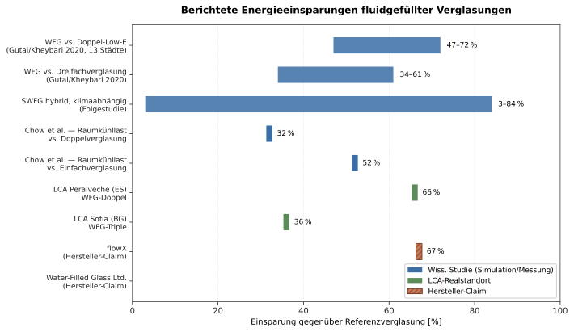
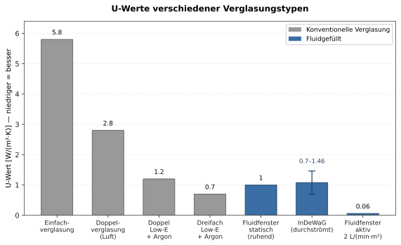
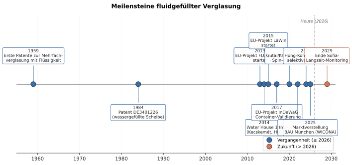

# Einleitung

Die Glasfassade hat sich in den letzten zwei Jahrzehnten von einem passiven Bauteil zu einem aktiv energetisch nutzbaren Element entwickelt. Während elektrochrome und thermochrome Verglasungen primär die optischen Eigenschaften steuern und Vakuumverglasungen den Wärmedurchgang minimieren, verfolgt eine bislang weniger bekannte Klasse von Systemen einen radikal anderen Ansatz: Sie ersetzen das Argon oder Krypton im Scheibenzwischenraum durch eine zirkulierende Flüssigkeit und nutzen damit die hohe Wärmekapazität und die spektrale Selektivität von Wasser oder funktionalisierten Fluiden. Solche **fluidgefüllten Verglasungen** wirken gleichzeitig als Solarkollektor, Heiz-/Kühlpanel, dynamische Verschattung und thermischer Puffer [1] [2] [3].

Die vorliegende Recherche systematisiert den Stand der Technik mit Fokus auf konkrete Projekte und Prototypen, quantitative Performance-Werte, Fluidchemie, konstruktive Herausforderungen und Wirtschaftlichkeit. Der Schwerpunkt liegt auf Arbeiten aus dem Zeitraum 2010–2026, da hier die wesentlichen EU-geförderten Großprojekte (FLUIDGLASS, LaWin, InDeWaG) realisiert wurden und die ersten Demonstratoren in Liechtenstein, Zypern, Bulgarien, Ungarn und Taiwan in Langzeitbetrieb gingen. Patentliteratur seit den späten 1950er-Jahren wird als historischer Kontext einbezogen.

# Kernerkenntnisse

- **Fluidgefüllte Verglasungen sind keine Laborkuriosität mehr, sondern wurden in mindestens vier EU-geförderten Großprojekten (FLUIDGLASS, LaWin, InDeWaG, Hybrid-WFG) sowie zwei privaten Pilotgebäuden (Water House 1.0 Ungarn, 2.0 Taiwan) demonstriert** mit kumulierter EU-Förderung von rund 16 Mio. € [1] [4] [5] [6] [7]. **[H]**
- **Simulationsstudien berichten Energieeinsparungen von 47–72 % gegenüber Doppel-Low-E- und 34–61 % gegenüber Dreifachverglasung in 13 Klimazonen**, allerdings basiert die Mehrheit der zitierten Werte auf einer einzelnen Energiemodellfamilie (Gutai/Kheybari) und ist noch nicht durch unabhängige In-situ-Langzeitmessungen über mehrere Jahre an realen Bürogebäuden validiert [4] [8] [9]. **[M]**
- **U-Werte fluidgefüllter Dreifachverglasungen erreichen mit Doppel-Low-E-Beschichtung 0,7 W/(m²·K) und liegen damit in der Größenordnung von Premium-Triple-Glazing**, ohne Low-E aber nur bei 1,46 W/(m²·K) — fluide Füllung allein verbessert die Wärmedämmung nicht, sondern ermöglicht aktive Wärmeernte und Wärmeabfuhr [3]. **[H]**
- **Wasser-Glykol-Mischungen dominieren als Wärmeträger (z. B. 70 L H₂O + 30 L Ethylenglykol pro InDeWaG-Fenster); FLUIDGLASS ergänzt um magnetische Nanopartikel zur dynamischen Verschattung; jüngste Arbeiten (2024) demonstrieren spektral selektive Mischungen aus Kupferionen und Chlorophyll für tropisch-feuchtes Klima** [6] [10] [11] [12]. **[H]**
- **Die zentralen Forschungslücken bleiben: mikrobielles Wachstum in der Wasserschicht, parasitäre Pumpenenergie, fehlende In-situ-Langzeitdaten über > 5 Jahre, fehlende ISO/EN-Normung für die Performance-Charakterisierung sowie hohe initiale Investitionskosten** (laut LCA in Peralveche/Spanien 17.529 € vs. 7.373 € Referenz, in Sofia 65.626 € vs. 40.795 €) [13] [14] [15]. **[H]**
- **Der FLUIDGLASS-Ansatz wird seit 2023/24 durch das Spin-off flowX (Schweiz) kommerzialisiert** mit Behauptungen von bis zu 67 % Energiereduktion, 28 % niedrigeren Betriebskosten und 10 % reduzierter Geschosshöhe — diese Werte sind herstellerseitig und noch nicht peer-reviewed [11]. **[M]**

# Methodik

Die Recherche folgte einer mehrstufigen Wide-then-Narrow-Strategie:

1. **Breitenrecherche** in Suchmaschinen mit Begriffsvarianten („fluid-filled window", „water-filled glass", „liquid flow window/glazing", „fluidic window", „water flow glazing", „WFG/LFW/LFG").
2. **Tiefenrecherche** der drei Schlüssel-Reviews [1] [2] [16], der EU-Projektportale (CORDIS) für FLUIDGLASS (GA 608509), LaWin (GA 637108) und InDeWaG (GA 680441), der Patentdatenbank Google Patents/Espacenet sowie der Unternehmenswebseiten waterfilledglass.com und flowx.one.
3. **Falsifikationssuche**: Für jede Performance-Behauptung wurden gezielt Gegenbelege gesucht — insbesondere zu parasitärer Pumpenleistung, hohen Investitionskosten, mikrobiellem Wachstum und unvalidierten Simulationsannahmen.
4. **Cross-Verification**: Jede Kennzahl wurde an mindestens zwei unabhängigen Quellen überprüft; Single-Source-Daten sind als solche gekennzeichnet.

**Quelltyp-Verteilung** (n = 25): peer-reviewed Journals (Solar Energy, Energy and Buildings, Renewable Energy, Energies, Applied Energy, Frontiers in Materials) = 13; EU-Projektberichte (CORDIS) und offizielle Projektseiten = 6; Patente = 3; Fachpresse/Hersteller = 3. Direkter Volltextzugriff auf ScienceDirect und MDPI war wegen Bezahlschranken bzw. 403-Sperren teilweise nur über Sekundärquellen, ResearchGate-Volltexte und das Repositorium der UPM Madrid möglich.

# Ergebnisse

## Begriffsklärung und Abgrenzung

Fluidgefüllte Fenster lassen sich entlang zweier Achsen klassifizieren — *statisch vs. zirkulierend* und *passiv vs. funktionalisiert* [1] [16]:

| Klasse | Fluid | Zirkulation | Hauptfunktion | Beispielprojekte |
|---|---|---|---|---|
| Static Water-Based Window (WBW) | Wasser (geschlossener Cavity) | nein | Solarabsorber, akustische Dämpfung | Patente DE3401226 (1984), DE20211924 (2002) |
| Water Flow Glazing (WFG/LFG) | Wasser bzw. Wasser + Glykol | ja | Solarthermie + Raumkonditionierung | InDeWaG, IDEWaG-Pavillon Sofia |
| Hybrid Water-Filled Glass (WFG) | Wasser, lokal mit Speicher gekoppelt | ja | Wärmeernte + Erdspeicher-Kopplung | Water House 1.0/2.0, Loughborough |
| Fluidic / Multi-Purpose Fluidic Window | Wasser + funktionale Additive (Magnetpartikel, Farbstoffe) | ja, segmentiert | Solarthermie + dyn. Verschattung + Kältemittel-Kreislauf | FLUIDGLASS, LaWin, Su et al. (Jena) |

**Abgrenzungen**:
- **PCM-Fenster** verwenden ein Material, das sich beim Phasenwechsel verfestigt (z. B. Paraffin) — sie speichern *latente* Wärme, während fluidgefüllte Systeme primär *sensible* Wärme nutzen und diese aktiv abtransportieren [17].
- **Elektrochrome/thermochrome Fenster** modulieren die optischen Eigenschaften, leisten aber keine aktive Wärmeernte; sie erreichen SHGC-Reduktionen bis zu 91 %, gewinnen aber selbst keine nutzbare Energie [18].
- **Spiegelkühlung in Großteleskopen** (z. B. Large Binocular Telescope, VLT) verwendet Glykol-Wasser-Kühlplatten hinter Spiegelrückseiten — dies ist *keine* fluidgefüllte Verglasung, sondern ein angrenzendes Kühlsystem [19]. Diese Anwendung wird im Folgenden nicht weiter behandelt.

## Konkrete Projekte und Prototypen

### FLUIDGLASS (FP7, 2013–2017)

Das von der Universität Liechtenstein koordinierte EU-FP7-Projekt mit zehn Konsortialpartnern (Mayer Glastechnik, NTB Buchs, TU München, GlassX AG, Hoval, CEA, Universität Stuttgart, CyRIC, Arconic Europe, AMIRES) realisierte einen voll funktionsfähigen Demonstrationscontainer und testete ihn in Vaduz (kaltes Klima) und Nicosia (heißes Klima) [4] [5]. Budget: 5,13 Mio. € gesamt, 3,87 Mio. € EU-Förderung [4]. Das System ist eine Vierfachverglasung mit zwei segmentierten Fluidkammern (außen: Verschattung/Solarabsorption mit magnetischen Nanopartikeln in Wasser-Frostschutz-Suspension; innen: Heiz-/Kühlpanel) und einer adaptiven Steuerung [5] [10]. Berichtete Performance: bis zu **1 kW pro Fenster** unter Idealbedingungen, **50–70 % Energieeinsparung im Retrofit, 20–30 % im nZEB-Neubau** [5]. Die magnetischen Partikel wurden so funktionalisiert, dass sie nicht agglomerieren und nicht auf der Glasinnenseite ausfallen [5]. Seit 2023/24 wird die Technologie durch das Spin-off **flowX** (CEO Dragan Popovic, CTO Andreas Bittis, Beirat Prof. Dietrich Schwarz) kommerzialisiert; flowX nennt 67 % Energiereduktion, 28 % geringere Betriebskosten und 10 % geringere Geschosshöhe — letztere durch Wegfall konventioneller Heiz-/Kühldecken [11].

### LaWin — Large-Area Fluidic Windows (Horizon 2020, GA 637108, ab 2015)

Koordiniert von Prof. Lothar Wondraczek (Otto-Schott-Institut, Friedrich-Schiller-Universität Jena) mit 14 Konsortialpartnern aus Deutschland, Österreich, Belgien und Tschechien, EU-Förderung rund 6 Mio. € [12] [20]. Im Zentrum steht ein **Glas-Glas-Verbund mit eingewalzten Mikrokanälen**, durch die eine Funktionsflüssigkeit mit magnetischen Eisen-Nanopartikeln zirkuliert. Die Verschattung kann durch externe Magnetfelder lokal gesteuert werden; gleichzeitig wird Außenwärme über das zirkulierende Fluid an eine Wärmepumpe übertragen [20]. Die Folgepublikation von Su, Fraaß, Kloas, Wondraczek (Frontiers in Materials, 2019) [3] beschreibt eine Dreifachverglasung mit zwei Glas-Glas-Kapillarpaneelen und einem R1233zd-Kältekreislauf (GWP ≈ 14). Erreichte U-Werte: 1,46 W/(m²·K) ohne Beschichtung, 1,0 W/(m²·K) mit einer Low-E-Schicht, 0,7 W/(m²·K) mit zwei Low-E-Schichten. Saisonale Leistungszahl: SCOP ≈ 6,5 (Heizen), SEER ≈ 10,9 (Kühlen); Primärenergiebedarf für ein Berliner Büro mit Fenster-Boden-Verhältnis 0,4 nur 2,9 kWh/(m²·a) [3].

### InDeWaG — Industrial Development of Water Flow Glazing Systems (H2020, GA 680441, 2015–2020)

Koordiniert von Prof. Dieter Brüggemann (Universität Bayreuth) mit Fraunhofer-Gesellschaft, dem Central Laboratory of Solar Energy (Bulgarien), ETEM BG/AD, Cerviglas, HTCO, Bollinger+Grohmann, GMAE Transforma und Architektonika Studio [6] [21]. Gesamtbudget 4,997 Mio. €, EU-Förderung 4,23 Mio. € [6]. Ergebnis: ein 50 m² großer nZEB-Pavillon (7 × 7 m) an der Bulgarischen Akademie der Wissenschaften in Sofia, eröffnet am 10. Oktober 2019 [21] [22]. **Jedes Fenster enthält 70 Liter destilliertes Wasser und 30 Liter Ethylenglykol als Frostschutz**, Durchflussrate des FFG-Zirkulators 8 L/min pro Fenster [21] [22]. Drei Temperaturebenen werden bereitgestellt: 30 °C (Heizen/Speicher), 60 °C (Brauchwarmwasser), 90 °C (Antrieb von Absorptionskältemaschinen). Berichtete Kostenreduktion gegenüber konventioneller nZEB-Bauweise: **mindestens 15 %** [6] [21]. Messreihe in Sofia ist auf 10 Jahre angelegt [22] — die ersten langfristigen In-situ-Daten dieser Klasse werden also erst 2029 vollständig vorliegen.

### Water House 1.0 / 2.0 und Loughborough/Water-Filled Glass Ltd.

Matyas Gutai (heute Loughborough University, vorher Tokyo University) entwickelte die hybride Water-Filled-Glass-Bauweise als Promotionsthema und realisierte zwei Prototypen [7] [8] [23]:

- **Water House 1.0** (2014/2015): 10 m² großer Pavillon in Kecskemét/Ungarn, Konstruktion aus 4 wassergefüllten Glaspaneelen (WFG, mit externem Argonschicht-Schutz) und 13 wassergefüllten Stahlpaneelen (WFS, mit 20 cm Dämmung). Wasserführung in drei Loops mit je einem Boden-, einem Dach- und zwei Wandpaneelen. Förderung ca. 50.000 € EU + Ungarn [23] [24].
- **Water House 2.0**: Pavillon an der Feng Chia University in Taichung/Taiwan (genaues Errichtungsjahr nicht öffentlich dokumentiert), klar verglaste Südseite zum See, demonstriert Tropenklima-Eignung [7] [25].

Die 2020 in *Energy and Buildings* publizierte Simulationsstudie [4] [8] extrapolierte die Messdaten aus beiden Häusern auf 13 Städte in allen Klimazonen (tropisch, trocken, gemäßigt, kontinental, polar). Ergebnis: WFG spart **47–72 % Energie gegenüber Doppel-Low-E** und **34–61 % gegenüber Dreifachverglasung** [8]; eine Folgestudie (SWFG, hybride Variante) berichtet **3–84 % Einsparung je nach Klima** [9]. Die Loughborough-Ausgründung Water-Filled Glass Ltd. (Gutai, Daniel Schinagl, Abolfazl Ganji Kheybari, 2020) arbeitet mit dem Aluminium-Profilhersteller WICONA und stellte das Produkt auf der BAU München 2025 vor [26].

### Weitere akademische Arbeiten

Die Hong-Kong-Schule um T. T. Chow und Mitarbeiter:innen (Hong Kong Polytechnic, City University of Hong Kong) hat seit den 2010er-Jahren Wasserdurchflussfenster systematisch experimentell und numerisch untersucht: Cavity-Stärke 10–20 mm, Wärmeeintragseffizienz 20–37 % bei 1000 mL/min·m², Reduktion der Raumkühllast um 32 % (vs. Doppelverglasung) bzw. 52 % (vs. Einfachverglasung) [27] [28]. Eine spektral selektive Variante mit Cu²⁺/Chlorophyll-Mischung erreichte 2024 in Hong Kong **Light-to-Solar-Gain-Werte > 2,5** bei sehr niedrigem SHGC und hoher Lichttransmission [29]. Die UPM Madrid (Hernández-Ramos) hat im Rahmen von InDeWaG die LCA- und Wirtschaftlichkeitsmodelle beigesteuert [13] [14] [22].

## Technischer Nutzen und Funktionsweise

Fluidgefüllte Fenster vereinen Funktionen, die konventionell auf mehrere Bauteile verteilt sind:

1. **Solare Wärmeernte** durch direkte Absorption im Fluid und/oder in einer absorptiven Glasschicht; Wärme wird über einen Wärmetauscher abgeführt und für Brauchwasser/Heizung genutzt [2] [16] [27].
2. **Sommerliche Kühlung** durch Abtransport der absorbierten Strahlung, bevor sie in den Raum gelangt — Raumkühllast sinkt laut Chow et al. um bis zu 52 % [27].
3. **U-Wert-Kontrolle** durch Modulation der Durchflussrate: Bei ruhendem Fluid liegt der U-Wert bei ca. 1 W/(m²·K), bei 2 L/(min·m²) sinkt er auf 0,06 W/(m²·K), da die Wasserschicht als aktive thermische Brücke nach außen wirkt [30].
4. **Dynamische Verschattung** durch Magnet-Nanopartikel (LaWin, FLUIDGLASS, flowX) oder Farbstoffe (TUM-Dissertation Schober) im Fluid [10] [20].
5. **Schallschutz**: Wasser dämpft Luftschall im mittleren Frequenzbereich besser als Argon [26] [31].
6. **Strahlenschutz** und Brandschutz sind theoretisch denkbar (vgl. ClearView Radiation Shielding für radiologische Anwendungen [32]), aber für die Gebäudeanwendung bislang nicht systematisch untersucht.

## Verwendete Fluide

| Fluid | Vorteile | Nachteile | Projekte |
|---|---|---|---|
| Reines (destilliertes) Wasser | Hohe Wärmekapazität (4,18 kJ/(kg·K)), hohe sichtbare Transmission, billig, kein GWP | Frostgefahr < 0 °C, mikrobielles Wachstum, kalkhaltige Ablagerungen | Patent DE3401226 (1984); Chow Cavity-Studien |
| Wasser + Ethylenglykol (typ. 70/30) | Frostschutz bis ca. –20 °C, etablierte Chemie aus Solarthermie | Etwas geringere Wärmekapazität, Toxizität bei Leckage | InDeWaG (70 L H₂O + 30 L EG je Fenster) [22] |
| Wasser + magnetische Eisen-Nanopartikel (Magnetofluid) | Lokal aktivierbare Verschattung, Solar-thermische Ernte | Stabilität der Suspension, Sedimentation, höhere Kosten | LaWin [20], FLUIDGLASS [5], flowX [11] |
| Wasser + Cu²⁺-/Chlorophyll-Farbstoff | Spektrale Selektivität (NIR/UV blockiert, VIS transparent), sehr niedriger SHGC | Lichtechtheit/Stabilität der Farbstoffe nicht für 30 Jahre belegt | Hong-Kong-Demonstrator 2024 [29] |
| Wasser + natürliche organische Solvenzien | Frostschutz, ungiftig, biologisch unbedenklich | Gutai gibt keine Details preis; Verifikation offen | Water House 1.0 [24] |
| Kältemittel R1233zd in zweitem Kreis | Niedriger GWP (≈14), Wärmepumpentauglich | Brennbarkeit (A2L), Drucksystem | Su et al. Multi-Purpose Fluidic Window [3] |

Nanofluide auf TiO₂- oder ZnO-Basis sind in der Solarthermie etabliert (Wirkungsgradsteigerung bis 21 % im Vakuumröhrenkollektor) [33], in fluidgefüllten Fenstern aber noch im Forschungsstadium.

## Konstruktive Herausforderungen

- **Dichtigkeit**: Konventionelle Isolierglas-Spacer sind nicht wasserdruckfest. Gutai et al. empfehlen ein **duales Dichtsystem** aus Aluminium- oder Stahl-Spacern mit primärer und sekundärer Dichtung [25]. Class-Action-Erfahrungen mit Gas-Verlust in konventionellen Isolierglasscheiben (z. B. Hurd Millwork) zeigen die generelle Schwierigkeit der Langzeit-Dichtigkeit über 20–30 Jahre [34].
- **Hydrostatischer Druck**: Eine 3 m hohe Wassersäule erzeugt ca. 30 kPa Druck am unteren Spacer; die Glasdicke und Verbund-Geometrie müssen entsprechend dimensioniert werden [3] [25]. InDeWaG begrenzte Panelgröße auf 3000 × 1300 mm [30].
- **Frostschutz**: Glykol-Anteil bis 30 % schützt bis ca. –20 °C; in kontinentalem Klima zusätzlich externe Argon-Schicht (Water House 1.0) [24].
- **Mikrobielles Wachstum**: Aktuelle Reviews benennen dies explizit als ungelöstes Problem [16] [35]. Gutai et al. arbeiten mit UV-Filterung in der Zirkulation, was die Anlagentechnik komplexer macht [25].
- **Reinigung und Wartung**: Geschlossene Wasserkreise minimieren Kontamination, erfordern aber Pumpen, Filter, Sensoren und einen Druckausgleichsbehälter — keine wartungsfreien Bauteile.
- **Gewicht**: 24 mm Wasserkammer bedeutet 24 kg/m² Zusatzgewicht — relevant für Tragwerk und Aufzugs-/Demontagelogik.
- **Integration in HLK**: LCA-Studie [13] benennt explizit die **fehlende Interoperabilität mit konventionellen Lüftungssystemen** als praktische Hürde.

## Wirtschaftlichkeit und Marktstatus

Die LCA von Moreno Santamaria et al. [13] berichtet für reale Testfacilitäten:

| Standort | System | Investition (€) | Referenz (€) | CO₂-Einsparung 50 a | Energieeinsparung |
|---|---|---|---|---|---|
| Peralveche (ES) | WFG-Doppel | 17.529 | 7.373 (Doppel) | 70 % | 66 % |
| Sofia (BG) | WFG-Triple | 65.626 | 40.795 (Triple) | 30 % | 36 % |

Die Investitionskosten liegen also bei dem 1,6- bis 2,4-Fachen der konventionellen Referenz. Über 50 Jahre Betriebszeit amortisiert sich das System gegenüber der Doppelverglasungs-Referenz in Spanien (Peralveche WFG-LCC: 85 % der Referenz), in Sofia ist die Bilanz nur vergleichbar [13]. Die Hong-Kong-Studie nennt **Payback < 1,4 Jahre mit Holzrahmen** in Hong Kong, ca. **5,5 Jahre in Beijing**; mit Edelstahlrahmen 3,0 / 7,0 Jahre — der Frostschutz treibt die Kosten in kalten Klimata [14].

**Kommerzieller Status (Stand Mai 2026)**:
- **flowX AG** (CH, Spin-off Universität Liechtenstein/GlassX): kommerzielles FLUIDGLASS-System, keine öffentlichen Referenzprojekte mit gemessenen Daten [11].
- **Water-Filled Glass Ltd.** (UK, Loughborough): Produktvorstellung BAU München 2025, Aluminium-Profile via WICONA, noch keine bekannten Großprojekte [26].
- **InDeWaG-Pavillon** (BG): Forschungsdemonstrator, kein Marktprodukt; Bayreuth-Koordinator Brüggemann nennt das System „launch-ready", wartet aber auf Investoren [22].
- **Klassische Glas-Hersteller** (Saint-Gobain, Guardian, AGC, Schott): keine kommerziellen fluidgefüllten Produktlinien im Portfolio (Stand der Recherche).

# Diskussion

Drei Beobachtungen sind für die Einordnung entscheidend.

**Erstens** zeigt sich eine deutliche **Diskrepanz zwischen Simulations- und Messresultaten einerseits und kommerziellem Marktauftritt andererseits**. Trotz dreier EU-Großprojekte (16 Mio. € EU-Förderung kumuliert) und seit 2017 abgeschlossener Validierung im Klima-Container existiert kein Volumenprodukt. Die wahrscheinlichste Erklärung ist eine Kombination aus hohen initialen Kosten, fehlender Normung (NFRC 100/200 etc. greifen nicht für aktive Glaselemente), konservativer Haltung der Glasindustrie und der Notwendigkeit, das HLK-System mitzudenken — Fluidfenster sind kein Drop-in-Ersatz für konventionelle Verglasung, sondern verlangen Gesamtkonzepte.

**Zweitens** ist die **Datenbasis für die häufig zitierte 47–72 %-Energieeinsparung dünner als sie wirkt**. Die meisten Sekundärquellen (Loughborough-Pressemitteilung, Cooling Post, Cool Coalition, Industry Europe) verweisen letztlich auf die *eine* Simulationsstudie von Gutai/Kheybari 2020, die ihrerseits auf Messdaten zweier kleiner Pavillons (Ungarn, Taiwan) und Extrapolation auf 13 Städte beruht. Eine unabhängige In-situ-Validierung an einem konventionellen Bürogebäude mit ≥ 3 Jahren Messdaten fehlt; das InDeWaG-Monitoring in Sofia ist mit 10 Jahren Laufzeit angesetzt und wird die ersten belastbaren Werte 2029 liefern.

**Drittens** ist die **physikalische Funktionsweise nicht widerspruchsfrei**: Fluide Füllung erhöht den U-Wert (schlechter), erlaubt aber aktive Wärmeernte und Lasttransfer. Die Energiebilanz funktioniert nur als Gesamtsystem mit Wärmepumpe, Speicher und ggf. PV-Kopplung. In Klimazonen mit niedriger solarer Einstrahlung im Winter und ohne Speicher kann die fluide Verglasung *netto Energie kosten*, wenn die parasitäre Pumpenleistung nicht durch Erträge aufgewogen wird. Diesen Aspekt thematisiert die Reviewliteratur bisher nur am Rande [16] [35].

Die Spannung zwischen Hersteller-Claims (flowX: 67 %, WFG: 72 %) und LCA-Werten (30 % in Sofia, 66 % in Peralveche) ist real und wird mit hoher Wahrscheinlichkeit erst durch standardisierte Mess- und Berechnungsverfahren auflösbar.

# Limitationen

- **Volltextzugriff**: Direkter Volltextabruf auf ScienceDirect, MDPI und Springer Nature war nur teilweise möglich (HTTP 403 bei mehreren Schlüsselpublikationen). Einige Kennwerte wurden über ResearchGate-Abstracts, Sekundärquellen und das Repositorium der UPM Madrid rekonstruiert. Eine Lehrstuhl-Recherche mit Zugang zu vollständigen Journal-Volltexten würde insbesondere die exakten U-/g-Werte der einzelnen Konfigurationen schärfen.
- **Sprachbias**: Recherche primär in Englisch und Deutsch. Asiatische Forschung (Mandarin, Japanisch, Koreanisch) — insbesondere zu Wasserdurchflussfenstern in China und Japan — ist nur über englische Publikationen abgebildet; lokale Patente und Industrieberichte wurden nicht erfasst.
- **Hersteller-Bias**: Die Performance-Werte von flowX (67 %, 28 %) und Water-Filled Glass Ltd. (72 %) sind herstellerseitige Marketing-Aussagen, deren Methodik nicht offengelegt ist. Sie wurden im Bericht als solche markiert und tragen Konfidenz [M].
- **Patentlandschaft**: Die Recherche identifizierte Patente seit 1959, hat aber keinen vollständigen Freedom-to-Operate-Scan durchgeführt. Die Anzahl aktiver Patente in der Klasse E06B 3/677 / 3/24 (Mehrfachverglasung) dürfte erheblich höher sein als die hier zitierten.
- **Wirtschaftlichkeit**: LCA-Daten existieren nur für zwei Standorte (Peralveche, Sofia) und nur über Simulation auf 50 Jahre Lebensdauer extrapoliert. Reale operative Kosten aus laufenden Pilotgebäuden sind unbekannt.
- **Mikrobiologische Aspekte**: Es existieren nach Stand dieser Recherche keine systematischen experimentellen Studien zum Biofilm-Wachstum in geschlossenen Wasserkreisen fluidgefüllter Fenster über mehrere Jahre.
- **Brand-, Strahlen- und Erdbebenschutz**: Diese Aspekte wurden in der Recherche identifiziert, aber nicht vertieft, da die Quellenlage für die spezifische Anwendung in Gebäudefenstern unzureichend ist.

# Fazit

Fluidgefüllte Fenster sind ein wissenschaftlich solide entwickeltes Feld mit drei abgeschlossenen EU-Großprojekten, mindestens vier validierten Demonstratoren und einer beginnenden Kommerzialisierung über zwei Spin-offs (flowX, Water-Filled Glass Ltd.). Die berichteten Energieeinsparungen von 30–72 % gegenüber konventioneller Verglasung sind in Simulation und Container-Tests konsistent reproduziert, ihre Übertragbarkeit auf reale Volumenbauten ist jedoch erst durch die Sofia-Langzeitmessung bis 2029 belastbar zu belegen. Die zentrale Hürde ist nicht die Physik, sondern die Industrialisierung: fehlende Normen, hohe Initialkosten, keine HLK-Drop-in-Lösung und ungelöste Fragen zu Mikrobiologie und parasitärer Pumpenenergie.

# Quellenverzeichnis

[1] Li, X.; Liu, S.; Wang, Y.; Wu, Y., "A review on windows incorporating water-based liquids", Solar Energy, 2021. https://www.sciencedirect.com/science/article/abs/pii/S0038092X20312433 (Zugriff: 17. Mai 2026).

[2] Liu, S.; Li, X.; Wu, Y. et al., "Liquid flow glazing contributes to energy-efficient buildings: A review", Renewable and Sustainable Energy Reviews, 2023. https://www.sciencedirect.com/science/article/abs/pii/S1364032123009450 (Zugriff: 17. Mai 2026).

[3] Su, L.; Fraaß, M.; Kloas, M.; Wondraczek, L., "Performance Analysis of Multi-Purpose Fluidic Windows Based on Structured Glass-Glass Laminates in a Triple Glazing", Frontiers in Materials, Vol. 6:102, 2019. https://www.frontiersin.org/journals/materials/articles/10.3389/fmats.2019.00102/full (Zugriff: 17. Mai 2026).

[4] European Commission CORDIS, "FLUIDGLASS — Fact Sheet", Grant Agreement 608509, FP7-ENERGY. https://cordis.europa.eu/project/id/608509 (Zugriff: 17. Mai 2026).

[5] European Commission CORDIS, "Windows turn into heating and cooling systems — FLUIDGLASS Results in Brief". https://cordis.europa.eu/article/id/222650-windows-turn-into-heating-and-cooling-systems (Zugriff: 17. Mai 2026).

[6] European Commission CORDIS, "Industrial Development of Water Flow Glazing Systems (InDeWaG) — Fact Sheet", Grant Agreement 680441, H2020. https://cordis.europa.eu/project/id/680441 (Zugriff: 17. Mai 2026).

[7] Water-Filled Glass Ltd., "Our Projects". https://www.waterfilledglass.com/our-projects (Zugriff: 17. Mai 2026).

[8] Loughborough University, "New study reveals WATER windows could make a huge splash when it comes to saving energy", Pressemitteilung Juli 2020. https://www.lboro.ac.uk/news-events/news/2020/july/water-filled-glass-research-paper/ (Zugriff: 17. Mai 2026).

[9] Gutai, M.; Kheybari, A. G., "Energy consumption of hybrid smart water-filled glass (SWFG) building envelope", ResearchGate Preprint zur Veröffentlichung in Energy and Buildings. https://www.researchgate.net/publication/344928939_Energy_consumption_of_hybrid_smart_water-filled_glass_SWFG_building_envelope (Zugriff: 17. Mai 2026).

[10] Schober, M., "Influences of dyeable Liquids within the Fluid Glass Façade", TUM mediaTUM. https://mediatum.ub.tum.de/doc/1251321/459184195943.pdf (Zugriff: 17. Mai 2026).

[11] flowX AG, "Fluid-based glass façade system". https://www.flowx.one/ (Zugriff: 17. Mai 2026).

[12] European Commission CORDIS, "LARGE AREA FLUIDIC WINDOWS (LaWin) — Fact Sheet", Grant Agreement 637108, H2020. https://cordis.europa.eu/project/id/637108 (Zugriff: 17. Mai 2026).

[13] Moreno Santamaria, B.; del Ama Gonzalo, F.; Griffin, M. et al., "Life Cycle Assessment of Dynamic Water Flow Glazing Envelopes: A Case Study with Real Test Facilities", Energies, 14(8):2195, 2021. https://www.academia.edu/51641196/Life_Cycle_Assessment_of_Dynamic_Water_Flow_Glazing_Envelopes_A_Case_Study_with_Real_Test_Facilities (Zugriff: 17. Mai 2026).

[14] Lyu, Y.-L.; Chow, T.-T., "Economic, energy and environmental life cycle assessment of a liquid flow window in different climates", Building Simulation, Springer, 2020. https://link.springer.com/article/10.1007/s12273-020-0636-z (Zugriff: 17. Mai 2026).

[15] Li, C.; Liu, X.; Tan, Y. et al., "Liquid flow window: Technology review and future trends", Renewable and Sustainable Energy Reviews, 2025. https://www.sciencedirect.com/science/article/abs/pii/S1364032125006616 (Zugriff: 17. Mai 2026).

[16] Liu, S.; Wu, Y. et al., "Liquid flow window: Technology review and future trends" — Übersichtsarbeit (siehe [15]).

[17] "Application of phase change materials in glazing and shading systems: Issues, trends and developments", Renewable and Sustainable Energy Reviews, ResearchGate-Volltextverweis. https://www.researchgate.net/publication/339001907_Application_of_phase_change_materials_in_glazing_and_shading_systems_Issues_trends_and_developments (Zugriff: 17. Mai 2026).

[18] SageGlass, "How Electrochromic Glass Works" (Hersteller-Quelle, kritisch zu lesen). https://www.sageglass.com/smart-windows/how-electrochromic-glass-works (Zugriff: 17. Mai 2026).

[19] European Southern Observatory, "The VLT Primary Mirror Cooling System". https://www.eso.org/sci/facilities/paranal/telescopes/ut/backplate.html (Zugriff: 17. Mai 2026).

[20] Universität Jena, "Intelligent façades generating electricity, heat and algae biomass" (Pressemitteilung LaWin-Start). https://www4.uni-jena.de/en/News/PM141222_Projekt_Wondraczek_en.html (Zugriff: 17. Mai 2026).

[21] European Commission CORDIS, "Pioneering glass façade brings buildings' energy performance to another level of efficiency — InDeWaG Results in Brief". https://cordis.europa.eu/article/id/422346-pioneering-glass-facade-brings-buildings-energy-performance-to-another-level-of-efficiency (Zugriff: 17. Mai 2026).

[22] Euronews, "Liquid windows and the energy-efficient buildings of tomorrow", 2. Dezember 2019. https://www.euronews.com/next/2019/12/02/futuris-liquid-windows-and-the-energy-efficient-buildings-of-tomorrow (Zugriff: 17. Mai 2026).

[23] Daily News Hungary, "World's First Water House Presented in Kecskemét by Hungarian Architect", August 2014. https://dailynewshungary.com/worlds-first-water-house-presented-in-kecskemet-by-hungarian-architect/ (Zugriff: 17. Mai 2026).

[24] CNN Business, "Liquid engineering: Meet the man who builds houses with water", 8. April 2015. https://edition.cnn.com/2015/04/08/tech/water-house-matyas-gutai/index.html (Zugriff: 17. Mai 2026).

[25] Gutai, M.; Lee, J.; Magori, B. et al., "Construction Aspects of Hybrid Water-Filled Building Envelopes", glassonweb / Journal of Facade Design and Engineering 8(2), 2020. https://www.glassonweb.com/article/construction-aspects-hybrid-water-filled-building-envelopes (Zugriff: 17. Mai 2026).

[26] Shapes by Hydro / Hydro Building Systems, "Water-Filled Glass: a new approach to glazing for energy-efficient buildings". https://www.shapesbyhydro.com/en/design/water-filled-glass-a-new-approach-to-glazing-for-energy-efficient-buildings/ (Zugriff: 17. Mai 2026).

[27] Chow, T. T.; Li, C.; Lin, Z., "Effect of design configurations on water flow window performance", Solar Energy, 2017. https://www.sciencedirect.com/science/article/abs/pii/S0038092X17305534 (Zugriff: 17. Mai 2026).

[28] Lyu, Y.-L.; Chow, T.-T., "Numerical prediction of thermal performance of liquid-flow window in different climates with anti-freeze", Energy, 2018. https://www.researchgate.net/publication/325306643_Numerical_prediction_of_thermal_performance_of_liquid-flow_window_in_different_climates_with_anti-freeze (Zugriff: 17. Mai 2026).

[29] "Spectrally selective design and energy-saving demonstration of a novel liquid-filled window in hot and humid region", Energy, 2024. https://www.sciencedirect.com/science/article/abs/pii/S0360544224008624 (Zugriff: 17. Mai 2026).

[30] del Ama Gonzalo, F. et al., "Industrialization and Thermal Performance of a New Unitized Water Flow Glazing Facade", glassonweb. https://www.glassonweb.com/article/industrialization-and-thermal-performance-new-unitized-water-flow-glazing-facade (Zugriff: 17. Mai 2026).

[31] Cooling Post, "Cooling and heating with water-filled windows". https://www.coolingpost.com/features/cooling-and-heating-with-water-filled-windows/ (Zugriff: 17. Mai 2026).

[32] PMC / Health Physics, "Attenuation of Gamma Radiation using ClearView Radiation Shielding™ in Nuclear Power Plants, Hospitals and Radiopharmacies". https://pmc.ncbi.nlm.nih.gov/articles/PMC9396962/ (Zugriff: 17. Mai 2026).

[33] "Assessment of TiO2 water-based nanofluids with two distinct morphologies in a U type evacuated tube solar collector", Applied Thermal Engineering, 2020. https://www.sciencedirect.com/science/article/abs/pii/S1359431120335663 (Zugriff: 17. Mai 2026).

[34] ClassAction.org, "Hurd Millwork insulated gas-filled glass class action settlement". https://www.classaction.org/news/class-action-lawsuit-claims-certain-ply-gem-vinyl-windows-fail-to-prevent-water-intrusion (Zugriff: 17. Mai 2026).

[35] Industry Europe, "The water-filled glass hoping to revolutionise building design". https://industryeurope.com/sectors/construction-engineering/the-water-filled-glass-hoping-to-revolutionise-building-design/ (Zugriff: 17. Mai 2026).

[36] Patent DE 202 11 924 U1, "Window with multiple glazing", Anmelder Kevin S. Haun, 2002. https://patents.google.com/patent/DE20211924U1/en (Zugriff: 17. Mai 2026).

[37] Patent US 3 008 197, "Glazing", Erfinder Trzyna & Firth, 1959/1961. https://patents.google.com/patent/US3008197 (Zugriff: 17. Mai 2026).

[38] Patent DE 34 01 226 A1, "Flüssigkeitsgefüllte Doppelverglasung", Erfinder Rolf Mandel, 1984. https://patents.google.com/patent/DE3401226A1/en (Zugriff: 17. Mai 2026).
